# Conference Papers

This table compiles the papers presented at the conference, including a brief description, poster images, and links to resources such as the paper, code, and video. Some papers are highlighted, best paper candidates, or award candidates.

## Icons Legend

- 🏅 **Best Paper**: This paper has been selected as the best paper of the conference.
- 🏆 **Award Candidate**: This paper is an award candidate.
- 🌟 **Highlighted**: This paper is featured due to its innovation or significance.

## 3D

| Paper Title | Poster | Resources | Description |
|-------------|--------|-----------|-------------|
| **VGGT: Visual Geometry Grounded Transformer** 🏅 | 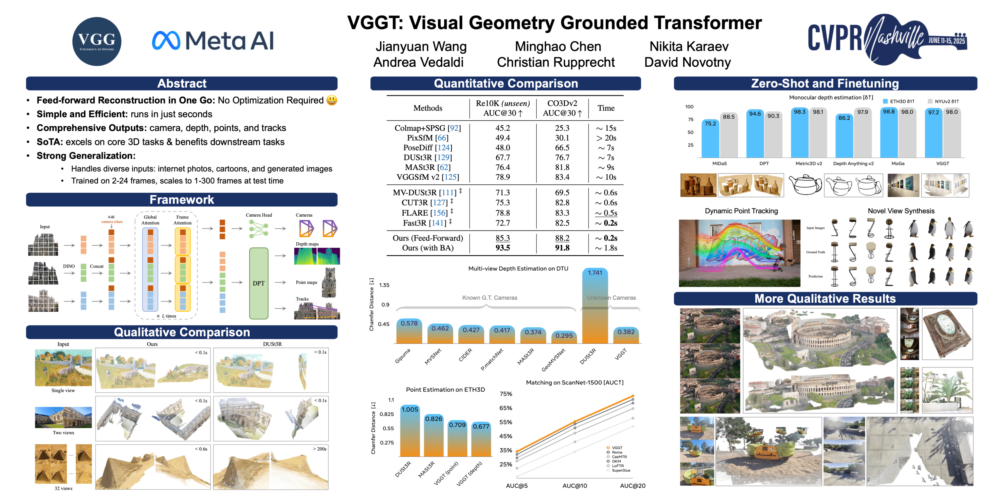 | [📄 Paper](https://arxiv.org/abs/2503.11651)   [💻 Code](https://github.com/facebookresearch/vggt)   [🎥 Video](https://youtu.be/7ZYwJEpCUUA) | 2D video or image to 3d scene model in seconds |
| **S3D: Sketch Driven 3D Model Generation**  | 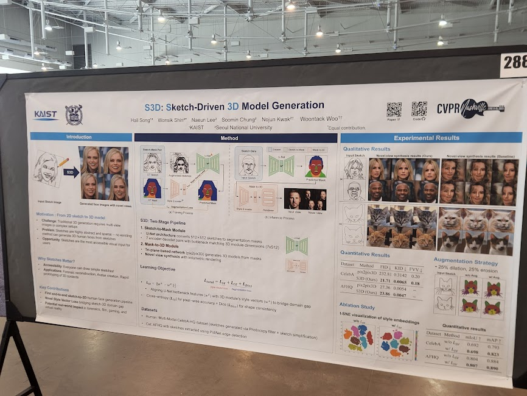 | [📄 Paper](https://arxiv.org/abs/2505.04185)   [💻 Code](https://github.com/hailsong/S3D)   [🎥 Video] | Generate 3D face from sketch |
| **Continuous 3D Perception Model with Persistent State**  | 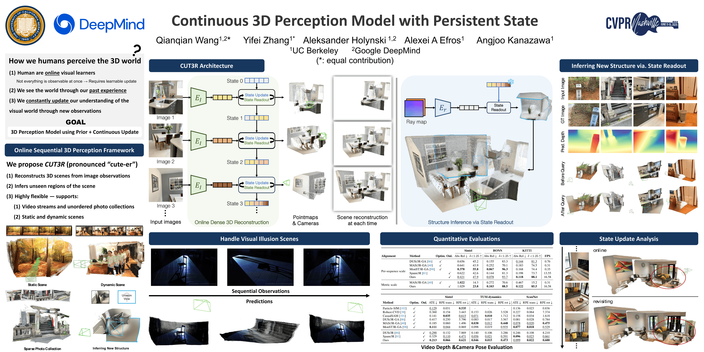 | [📄 Paper](https://openaccess.thecvf.com/content/CVPR2025/html/Wang_Continuous_3D_Perception_Model_with_Persistent_State_CVPR_2025_paper.html)   [💻 Code](https://cut3r.github.io/)  [🎥 Video] | 3D perception from video that can be used on dynamic scenes|
| **Robust Multi-Object 4D Generation for In-the-wild Videos**  |  | [📄 Paper](https://openaccess.thecvf.com/content/CVPR2025/papers/Chu_Robust_Multi-Object_4D_Generation_for_In-the-wild_Videos_CVPR_2025_paper.pdf)   [💻 Code](https://cat-4d.github.io/)  [🎥 Video] | Can generate dynamic 4d scenes from 2d videos. Motion is captured through a learnt deformation network |
| **CAT4D: Create Anything in 4D with Multi-View Video Diffusion Models**  |  | [📄 Paper](https://openaccess.thecvf.com/content/CVPR2025/papers/Chu_Robust_Multi-Object_4D_Generation_for_In-the-wild_Videos_CVPR_2025_paper.pdf)   [💻 Code]  [🎥 Video] | Create 4D scenes from single video |
| **Uni4D: Unifying Visual Foundation Models for 4D Modeling from a Single Video** 🌟  |  | [📄 Paper](https://openaccess.thecvf.com/content/CVPR2025/html/Yao_Uni4D_Unifying_Visual_Foundation_Models_for_4D_Modeling_from_a_CVPR_2025_paper.html)   [💻 Code](https://github.com/Davidyao99/uni4d)  [🎥 Video] | Create 4D models from single video |

## Audio Video Fusion

| Paper Title | Poster | Resources | Description |
|-------------|--------|-----------|-------------|
| **Adapting to the Unknown: Training-Free Audio-Visual Event Perception with Dynamic Thresholds**  | 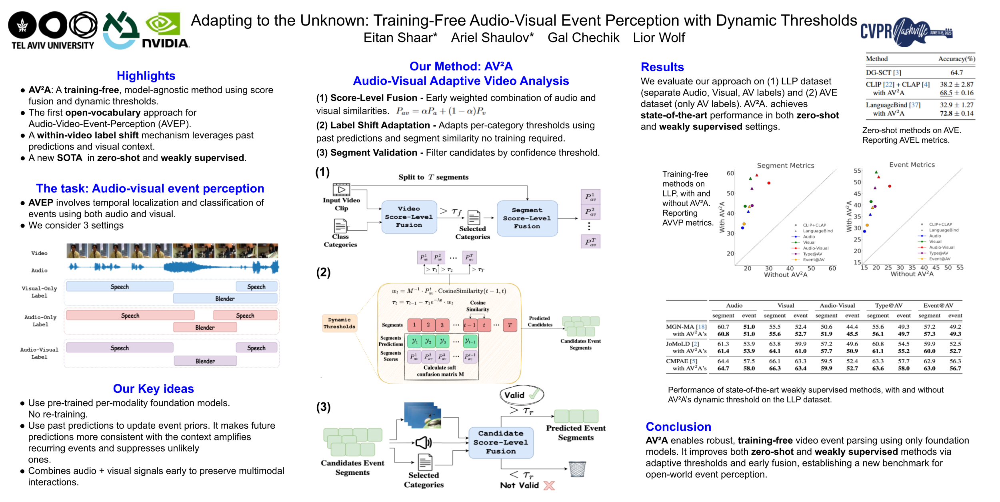 | [📄 Paper](https://openaccess.thecvf.com/content/CVPR2025/html/Shaar_Adapting_to_the_Unknown_Training-Free_Audio-Visual_Event_Perception_with_Dynamic_CVPR_2025_paper.html)   [💻 Code]  [🎥 Video] | Audio Visual Event understanding to boost foundation models |
| **AVS-Net: Audio-Visual Scale Network for Self-Supervised Monocular Metric Depth Estimation**  | NA | [📄 Paper](https://arxiv.org/abs/2412.01637)   [💻 Code]  [🎥 Video] | Audio-visual approach to depth estimation using echolocation |
| **UWAV: Uncertainty-weighted Weakly-supervised Audio-Visual Video Parsing**  | 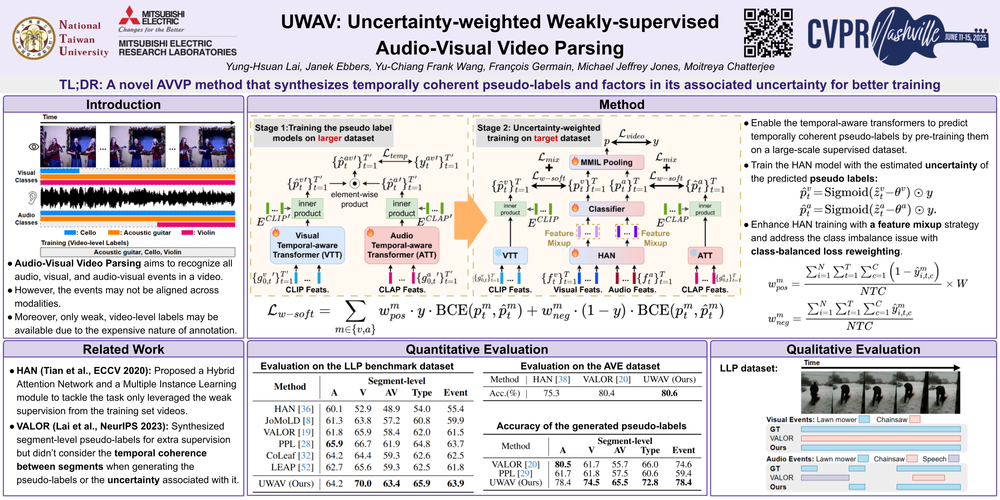 | [📄 Paper](https://openaccess.thecvf.com/content/CVPR2025/html/Lai_UWAV_Uncertainty-weighted_Weakly-supervised_Audio-Visual_Video_Parsing_CVPR_2025_paper.html)   [💻 Code]  [🎥 Video] | AVVP approach that overcomes weakness in inter-segment dependencies and achieve SOTA |
| **LongVALE: Vision-Audio-Language-Event Benchmark Towards Time-Aware Omni-Modal Perception of Long Videos**  |  | [📄 Paper](https://openaccess.thecvf.com/content/CVPR2025/html/Geng_LongVALE_Vision-Audio-Language-Event_Benchmark_Towards_Time-Aware_Omni-Modal_Perception_of_Long_Videos_CVPR_2025_paper.html)   [💻 Code](https://github.com/ttgeng233/LongVALE)  [🎥 Video](https://youtu.be/TT55jG2tSrQ) | A multimodal vision audio language dataset for temporal understanding, and audio-visual event captioning/detection. Also has their own model with training recipe which has good performance for temporal events. |
| **LiveCC: Learning Video LLM with streaming speech transcription at scale**  |  | [📄 Paper](https://openaccess.thecvf.com/content/CVPR2025/html/Chen_LiveCC_Learning_Video_LLM_with_Streaming_Speech_Transcription_at_Scale_CVPR_2025_paper.html)   [💻 Code](https://github.com/showlab/livecc)  [🎥 Video](https://youtu.be/56sfodoHXo4) | Live closed-captioning / commentary of streaming video events in real time |
| **Supervising Sound Localization by In-the-wild Egomotion**🌟  | 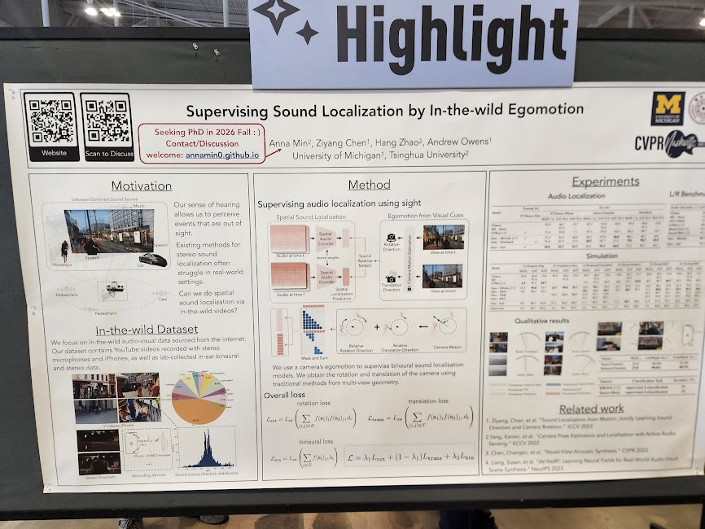 | [📄 Paper](https://openaccess.thecvf.com/content/CVPR2025/html/Min_Supervising_Sound_Localization_by_In-the-wild_Egomotion_CVPR_2025_paper.html)(https://openaccess.thecvf.com/content/CVPR2025/papers/Min_Supervising_Sound_Localization_by_In-the-wild_Egomotion_CVPR_2025_paper.pdf)   [💻 Code]  [🎥 Video] | Sound direction prediction with respect to the position / motion of the camera. Code out soon |
| **AVIGATE: Learning Audio-guided Video Representation with Gated Attention for Video-Text Retrieval**  | 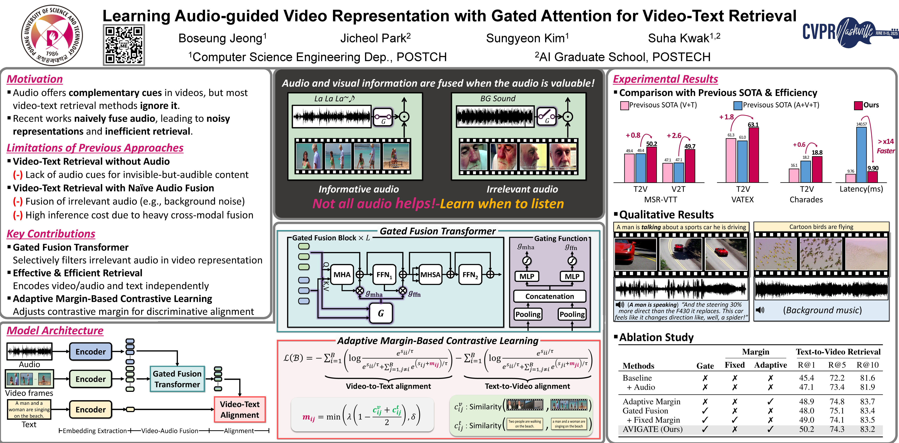 | [📄 Paper](https://arxiv.org/abs/2504.02397)   [💻 Code]  [🎥 Video] | A gated fusion approach to toggle audio on and off for video understanding depending learnt relevance. Audio + Video encoded together and identify relevance through gated function with text embeddings. Open Source eventually.  |
| **Robust Audio-Visual Segmentation via Audio-Guided Visual Convergent Alignment**  |  | [📄 Paper](https://openaccess.thecvf.com/content/CVPR2025/html/Liu_Robust_Audio-Visual_Segmentation_via_Audio-Guided_Visual_Convergent_Alignment_CVPR_2025_paper.html)   [💻 Code]  [🎥 Video] | Audio Visual segmentation approach through learnt visual audio representations. Open source eventually. |
| **Crab: A Unified Audio-Visual Scene Understanding Model with Explicit Cooperation**  | 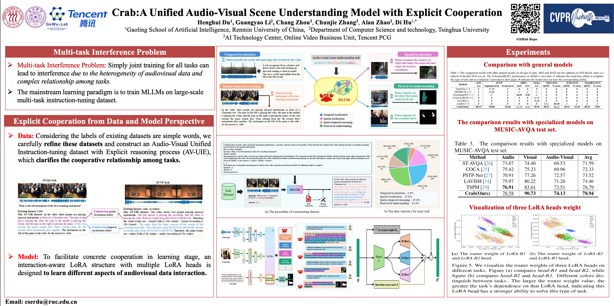 | [📄 Paper](https://openaccess.thecvf.com/content/CVPR2025/html/Du_Crab_A_Unified_Audio-Visual_Scene_Understanding_Model_with_Explicit_Cooperation_CVPR_2025_paper.html)   [💻 Code](https://github.com/GeWu-Lab/Crab)  [🎥 Video](https://youtu.be/-zi-PzVNQI0) | Audio Visual scene understanding architecture that can be used via finetuning |

## Image Restoration / Enhancement

| Paper Title | Poster | Resources | Description |
|-------------|--------|-----------|-------------|
| **HVI: A New Color Space for Low-light Image Enhancement**  |  | [📄 Paper](https://openaccess.thecvf.com/content/CVPR2025/html/Yan_HVI_A_New_Color_Space_for_Low-light_Image_Enhancement_CVPR_2025_paper.html)   [💻 Code](https://github.com/Fediory/HVI-CIDNet)  [🎥 Video](https://youtu.be/_Zskake1NmQ) | Real time deblurring, denoising, low-light and overexposure enhancement |
| **OSDFace: One-Step Diffusion Model for Face Restoration**  |  | [📄 Paper](https://arxiv.org/abs/2411.17163)   [💻 Code](https://github.com/jkwang28/OSDFace)  [🎥 Video] | Promising efficient face image enhancer/deblurrer. Can be used in a FR pipeline where initial match uses the blur image with original/augmented database before performing restoration and use it on the actual database if the initial match is beyond a certain threshold |
| **PatchVSR: Breaking Video Diffusion Resolution Limits with Patch-wise Video Super-Resolution**  | 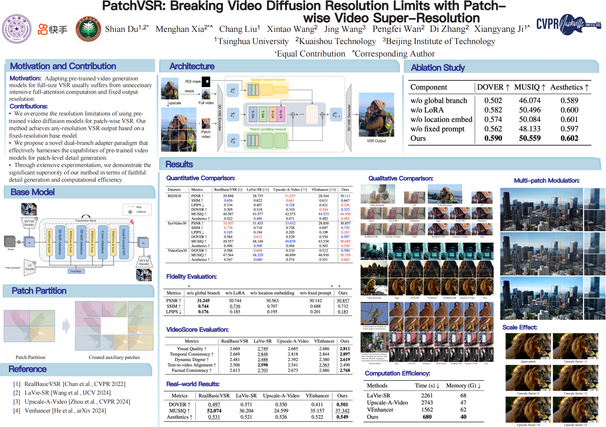 | [📄 Paper](https://openaccess.thecvf.com/content/CVPR2025/html/Du_PatchVSR_Breaking_Video_Diffusion_Resolution_Limits_with_Patch-wise_Video_Super-Resolution_CVPR_2025_paper.html)  [💻 Code]  [🎥 Video] | Video PatchWise super resolution using diffusion model |
| **Plug-and-Play Versatile Compressed Video Enhancement**  |  | [📄 Paper](https://arxiv.org/html/2412.08442v1)   [💻 Code]  [🎥 Video] | Method to overcome reduction in video quality from compressed video, proposes enhancement approach. Code to be out soon. |

## Detection, Tracking and Re-identification

| Paper Title | Poster | Resources | Description |
|-------------|--------|-----------|-------------|
| **AG-VPReID 2025: The 2nd Aerial-Ground Person ReID Challenge**  |  | [📄 Paper](https://arxiv.org/abs/2503.08121)   [💻 Code](https://github.com/agvpreid25/AG-VPReID)   [🎥 Video](https://youtu.be/00DhDxvwbiY)| Aerial-Ground view re-identification, from 8m to 120m height. Can be used for G2G, G2A, A2G |
| **CaMuViD: Calibration-Free Multi-View Detection** | 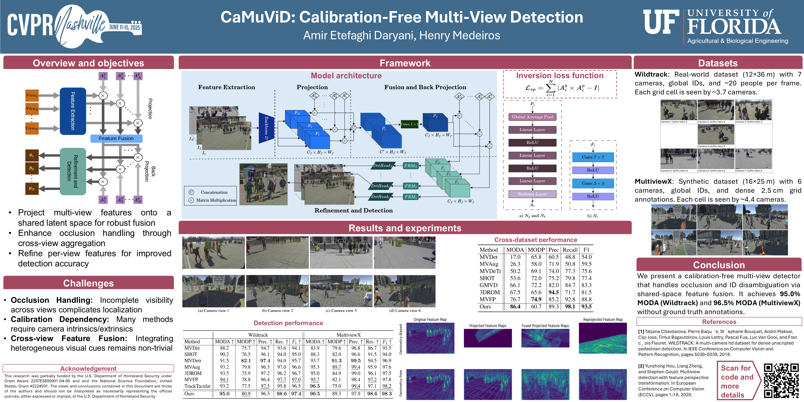 | [Paper](https://openaccess.thecvf.com/content/CVPR2025/papers/Daryani_CaMuViD_Calibration-Free_Multi-View_Detection_CVPR_2025_paper.pdf)   [Code](https://github.com/amiretefaghi/CaMuViD)   [Video](https://youtu.be/LJzFkKqth6g) | This paper presents [short description of the paper]. Award candidate. |
| **MambaVLT: Time-Evolving Multimodal State Space Model for Vision-Language Tracking**🌟  |  | [📄 Paper](https://openaccess.thecvf.com/content/CVPR2025/html/Liu_MambaVLT_Time-Evolving_Multimodal_State_Space_Model_for_Vision-Language_Tracking_CVPR_2025_paper.html)   [💻 Code]  [🎥 Video] | Vision Language Tracker using State Space model Mamba which is faster than transformers |
| **SAMWISE: Infusing Wisdom in SAM2 for Text-Driven Video Segmentation**🌟  | 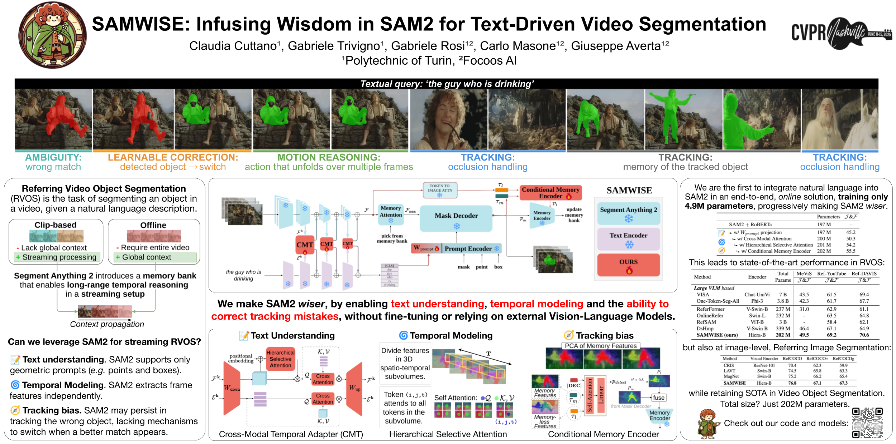 | [📄 Paper](https://openaccess.thecvf.com/content/CVPR2025/html/Cuttano_SAMWISE_Infusing_Wisdom_in_SAM2_for_Text-Driven_Video_Segmentation_CVPR_2025_paper.html)   [💻 Code](https://github.com/ClaudiaCuttano/SAMWISE)  [🎥 Video](https://youtu.be/OL3xvzFyXCc) | Prompt based segmentation implementation with temporal modelling and error correction for accurate video-based tracking. Can maybe test open vocab POI tracking and re-id |
| **Improving Open-World Object Localization by Discovering Background**  |  | [📄 Paper](https://arxiv.org/abs/2504.17626)   [💻 Code]  [🎥 Video] | Algorithm Approach to localize scene objects and ignoring background through the use of recognizing top occuring patches and features. Useful for case exhibit use cases and more lightweight |
| **DIFFER: Disentangling Identity Features via Semantic Cues for Clothes-Changing Person Re-ID**  | 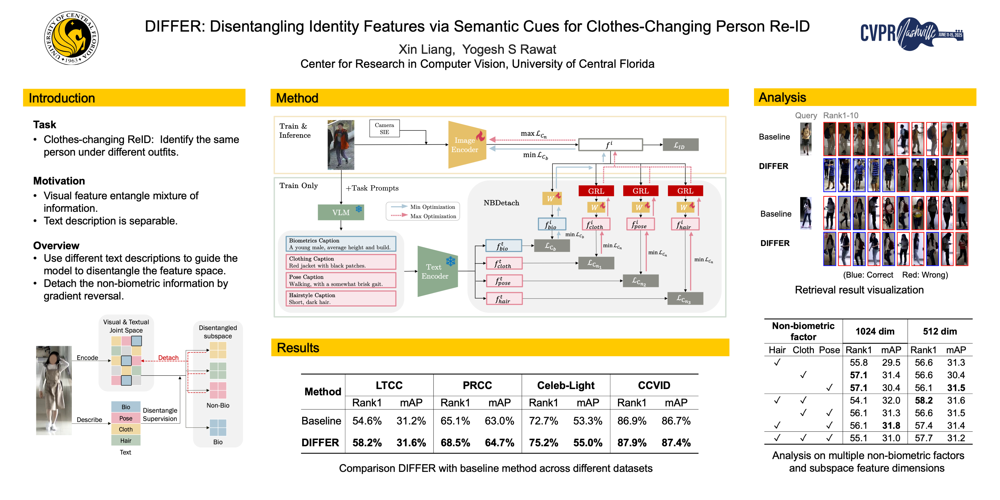 | [📄 Paper](https://openaccess.thecvf.com/content/CVPR2025/html/Liang_DIFFER_Disentangling_Identity_Features_via_Semantic_Cues_for_Clothes-Changing_Person_CVPR_2025_paper.html)(https://arxiv.org/abs/2503.22912)   [💻 Code]  [🎥 Video](https://youtu.be/0LbKwE-Bgck) | Re-id aimed to use learnt features from VLM to re-identifying persons that changed clothes through the use of Gradient-Reversal Layers |
| **Focusing on Tracks for Online Multi-Object Tracking**  | 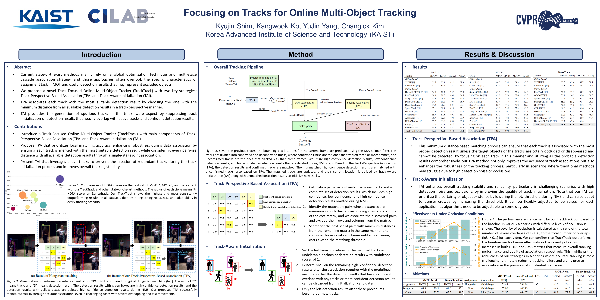 | [📄 Paper](https://openaccess.thecvf.com/content/CVPR2025/html/Shim_Focusing_on_Tracks_for_Online_Multi-Object_Tracking_CVPR_2025_paper.html)   [💻 Code](https://github.com/kamkyu94/TrackTrack)  [🎥 Video](https://youtu.be/q1VzXfqd6hs) | Tracking approach to leverage more on tracklets to track than heavy reliance on detection from regular trackers |
| **All-Day Multi-Camera Multi-Target Tracking**  |  | [📄 Paper](https://cvpr.thecvf.com/virtual/2025/poster/35125)  [💻 Code]  [🎥 Video] | Day and Night multicamera and multitarget tracking algorithm/models with built in re-id for cross-camera association |
| **EntitySAM: Segment Everything in Video**  | 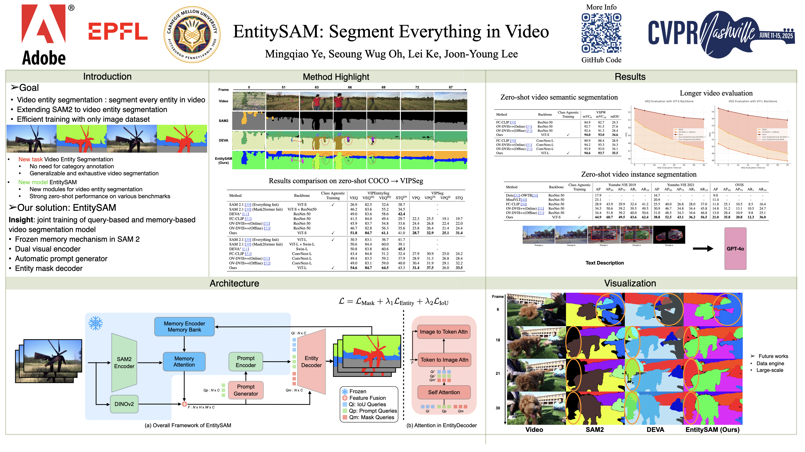 | [📄 Paper](https://openaccess.thecvf.com/content/CVPR2025/html/Ye_EntitySAM_Segment_Everything_in_Video_CVPR_2025_paper.html)  [💻 Code] (https://github.com/yuanc3/Pose2ID)  [🎥 Video] | SAM based tracking with memory encoder using features from Dinov2 as prompt into SAM |
| **Pose2ID: From Poses to Identity: Training-Free Person Re-Identification via Feature Centralization**  |  | [📄 Paper](https://openaccess.thecvf.com/content/CVPR2025/html/Yuan_From_Poses_to_Identity_Training-Free_Person_Re-Identification_via_Feature_Centralization_CVPR_2025_paper.html)  [💻 Code] (https://github.com/yuanc3/Pose2ID)  [🎥 Video] | Uses human + pose estimation to generate more images of the target person for feature enhancement through the use of StableDiffusion. Training free and modular, allowing for use of other re-id and pose estimation model. Speed may not be optimized. |
| **Learning from Synchronization: Self-Supervised Uncalibrated Multi-View Person Association in Challenging Scenes**  |  | [📄 Paper](https://arxiv.org/abs/2503.13739) [💻 Code] ()  [🎥 Video](https://youtu.be/5eAd6yUgdZg) | Approach to handle multiview association for synchronized footage (same timestamp) for detection tracking and re-id. Only intended for overlapping cameras. |
| **On Denoising Walking Videos for Gait Recognition**  | 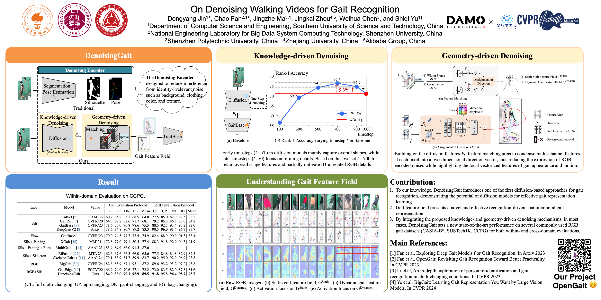 | [📄 Paper](https://arxiv.org/abs/2505.18582)  [💻 Code] () [🎥 Video] | An update from OpenGait to denoise walking videos for better gait extraction. Code out soon.|

## Deepfake

| Paper Title | Poster | Resources | Description |
|-------------|--------|-----------|-------------|
| **Diagnosing and Treating Audio-Video Fake Detection**  |  | [📄 Paper]   [💻 Code]  [🎥 Video] | Introduces DeepSpeak, an audio-video deepfake detector |
| **Rethinking Vision-Language Model in Face Forensics: Multi-Modal Interpretable Forged Face Detector**  | 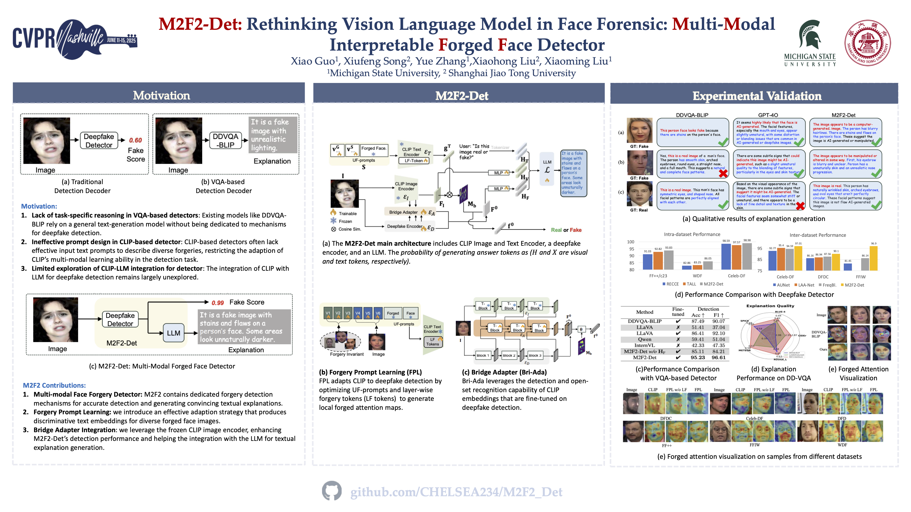 | [📄 Paper](https://openaccess.thecvf.com/content/CVPR2025/html/Guo_Rethinking_Vision-Language_Model_in_Face_Forensics_Multi-Modal_Interpretable_Forged_Face_CVPR_2025_paper.html)   [💻 Code]  [🎥 Video] | Multimodal Forged Face detector using VLM for text-based identification and explainability |

## Edge Models

| Paper Title | Poster | Resources | Description |
|-------------|--------|-----------|-------------|
| **EdgeVidSum: Real-Time Personalized Video Summarization at the Edge**  |  | [📄 Paper]   [💻 Code]  [🎥 Video] | Video Summarisation on Edge |
| **EdgeTAM: On-Device Track Anything Model**  |  | [📄 Paper](https://openaccess.thecvf.com/content/CVPR2025/html/Zhou_EdgeTAM_On-Device_Track_Anything_Model_CVPR_2025_paper.html)   [💻 Code]  [🎥 Video] | SAM2 Tracking on edge with 20x speed up on edge device|
| **LLMPi: Optimizing LLMs for High Throughput on Raspberry Pi**  |  | [📄 Paper]   [💻 Code]  [🎥 Video] | Research on efficient Best-in-Slot edge deployment of LLMs and proposed speech to speech pipeline |

## Foundation Models and Encoders

| Paper Title | Poster | Resources | Description |
|-------------|--------|-----------|-------------|
| **Token Cropr: Faster ViTs for Quite a Few Tasks**  |  | [📄 Paper](https://openaccess.thecvf.com/content/CVPR2025/html/Bergner_Token_Cropr_Faster_ViTs_for_Quite_a_Few_Tasks_CVPR_2025_paper.html)   [💻 Code](https://github.com/benbergner/cropr)  [🎥 Video](https://youtu.be/QK845XybsoY) | Faster ViT |
| **Perception Encoder: The best visual embeddings are not at the output of the network**  |  | [📄 Paper]   [💻 Code]  [🎥 Video] | New CLIP by meta, surpass CLIP for image tasks, with limited video capability due to poor temporal knowledge |
| **REN: Fast and Efficient Region Encodings from Patch-Based Image Encoders**  |  | [📄 Paper]   [💻 Code]  [🎥 Video] | High Speed and efficient image region encoders. New work not published in CVPR |
| **CAV-MAE Sync: Improving Contrastive Audio-Visual Mask Autoencoders via Fine-Grained Alignment**  | 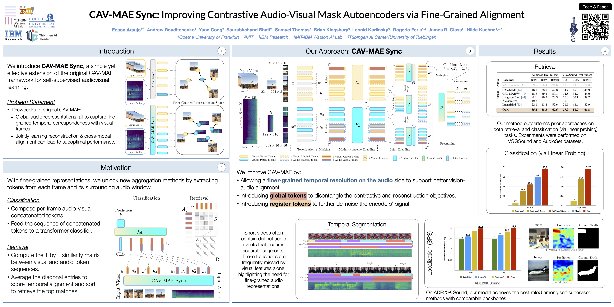 | [📄 Paper](https://openaccess.thecvf.com/content/CVPR2025/html/Araujo_CAV-MAE_Sync_Improving_Contrastive_Audio-Visual_Mask_Autoencoders_via_Fine-Grained_Alignment_CVPR_2025_paper.html)   [💻 Code]  [🎥 Video] | Better audio visual representation |
| **AdaVid: Adaptive Video-Language Pretraining**  |  | [📄 Paper]   [💻 Code]  [🎥 Video] | Scalable Video-Language foundation model for various compute requirements |
| **HoVLE: Unleashing the Power of Monolithic Vision-Language Models with Holistic Vision-Language Embedding**  |  | [📄 Paper](https://arxiv.org/abs/2412.16158)   [💻 Code]  [🎥 Video] | Alleviates loss of textual capability in LLMs when training into a VLM through the conversion of multimoda embeddings into hollistic embeddings |
| **MambaVision: A Hybrid Mamba-Transformer Vision Backbone**  | 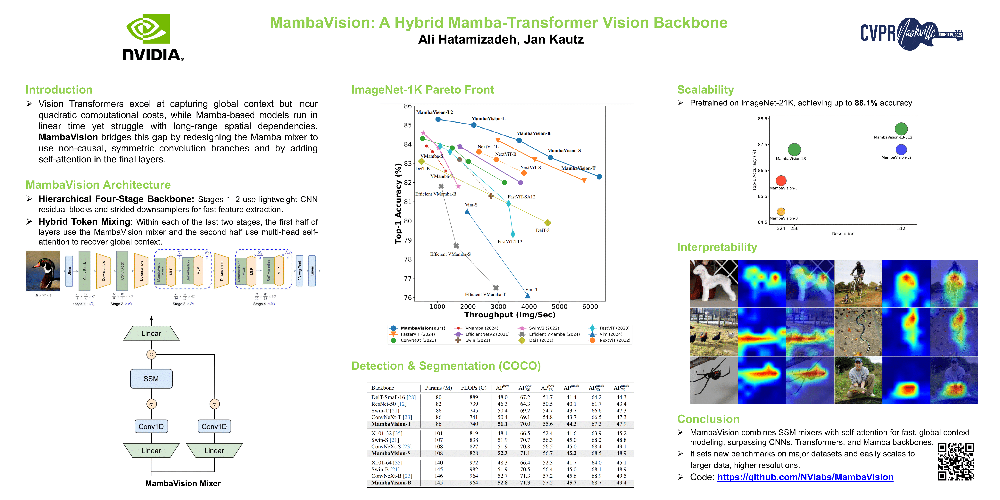 | [📄 Paper](https://arxiv.org/abs/2407.08083)   [💻 Code](https://github.com/NVlabs/MambaVision)  [🎥 Video] | Alleviates loss of textual capability in LLMs when training into a VLM through the conversion of multimoda embeddings into hollistic embeddings |

## Video Understanding / Summary

| Paper Title | Poster | Resources | Description |
|-------------|--------|-----------|-------------|
| **VideoICL: Confidence-based Iterative In-context Learning for Out-of-Distribution Video Understanding**  |  | [📄 Paper](https://openaccess.thecvf.com/content/CVPR2025/html/Kim_VideoICL_Confidence-based_Iterative_In-context_Learning_for_Out-of-Distribution_Video_Understanding_CVPR_2025_paper.html)   [💻 Code](https://github.com/KangsanKim07/VideoICL)  [🎥 Video]| In Context Learning approach for video understanding. |
| **STPro: Spatial and Temporal Progressive Learning for Weakly Supervised Spatio-Temporal Grounding**  |  | [📄 Paper](https://openaccess.thecvf.com/content/CVPR2025/html/Garg_STPro_Spatial_and_Temporal_Progressive_Learning_for_Weakly_Supervised_Spatio-Temporal_CVPR_2025_paper.html)   [💻 Code](https://aaryangrg.github.io/research/stpro)  [🎥 Video](https://youtu.be/Opurm9Syxso) | Process Spatial and Temporal separately for better understanding |
| **Open World Scene Graph Generation using VLM**  |  | [📄 Paper]   [💻 Code]  [🎥 Video] | A trainingless VLM and grounding DINO appoach to generate scene graph |
| **SimCache: Similarity Caching for Efficient VLM-based Scene Understanding**  |  | [📄 Paper]   [💻 Code]  [🎥 Video] | Proposed idea of software cache to store scene embeddings and reduce need for redundant frame inference for similar frames. No paper. |
| **Video-XL: Extra-Long Vision Language Model for Hour-Scale Video Understanding**  |  | [📄 Paper] (https://openaccess.thecvf.com/content/CVPR2025/html/Shu_Video-XL_Extra-Long_Vision_Language_Model_for_Hour-Scale_Video_Understanding_CVPR_2025_paper.html)   [💻 Code](https://github.com/VectorSpaceLab/Video-XL/tree/main/Video-XL-2)   [🎥 Video] | Proposed Llava + compression + dynamic interval pipeline. Frame cosine similarity to decide dynamic sampling interval (low fps for high similarity) |
| **SEAL: Semantic Attention Learning for Long Video Representation**  | 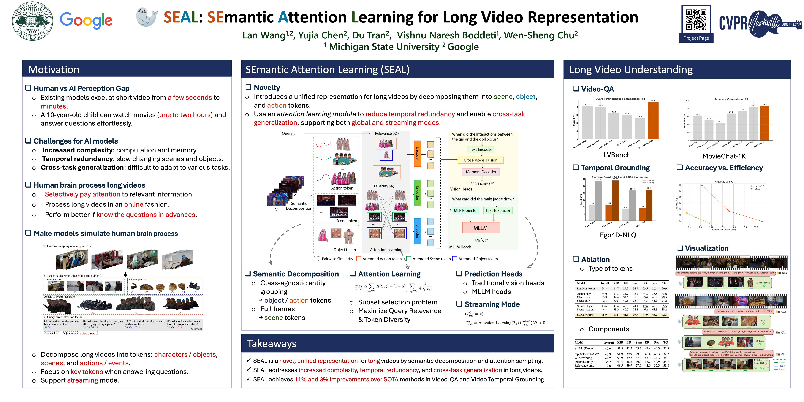 | [📄 Paper] (https://openaccess.thecvf.com/content/CVPR2025/html/Wang_SEAL_Semantic_Attention_Learning_for_Long_Video_Representation_CVPR_2025_paper.html)   [💻 Code]()   [🎥 Video] | Overcoming challenges in video understanding by decomposing to scene, object and action based understanding. Through specialized tokens and incorporation of other modules such as SAM for more hollistic and accurate understanding. |

## VLM

| Paper Title | Poster | Resources | Description |
|-------------|--------|-----------|-------------|
| **Dispider: Enabling Video LLMs with Active Real-Time Interaction via Disentangled Perception, Descision and Reaction**  |  | [📄 Paper](https://openaccess.thecvf.com/content/CVPR2025/html/Qian_Dispider_Enabling_Video_LLMs_with_Active_Real-Time_Interaction_via_Disentangled_CVPR_2025_paper.html)   [💻 Code](https://github.com/Mark12Ding/Dispider)  [🎥 Video] | Streaming VLM that can proactively provide streaming response over time without the need for repeated use prompting |
| **FastVLM: Efficient Vision Encoding for Vision Language Models**  | 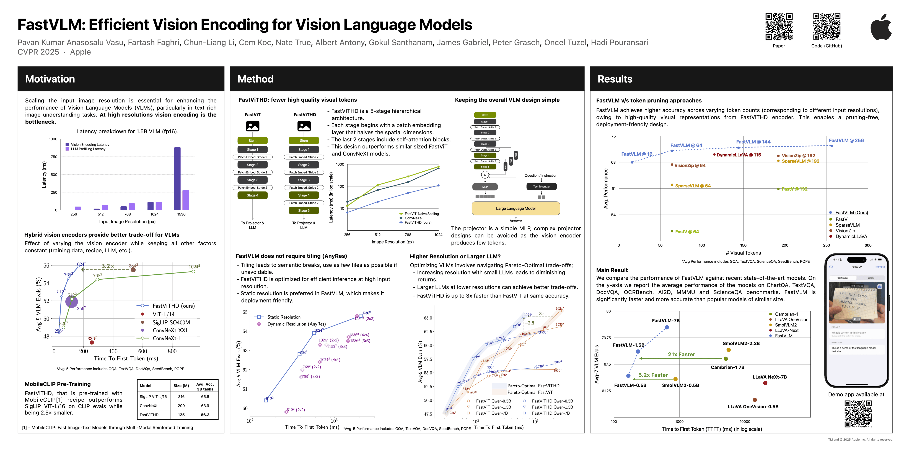 | [📄 Paper](https://openaccess.thecvf.com/content/CVPR2025/html/Vasu_FastVLM_Efficient_Vision_Encoding_for_Vision_Language_Models_CVPR_2025_paper.html)   [💻 Code](https://github.com/apple/ml-fastvlm)  [🎥 Video] | 0.5b to 7b VLM that can process HD videos in speeds faster than Smolvlm 0.5b through the use of their custom FastViTHD backbone. By Apple. |
| **Dino.txt: DINOv2 Meets Text: A Unified Framework for Image- and Pixel-Level Vision-Language Alignment**  | 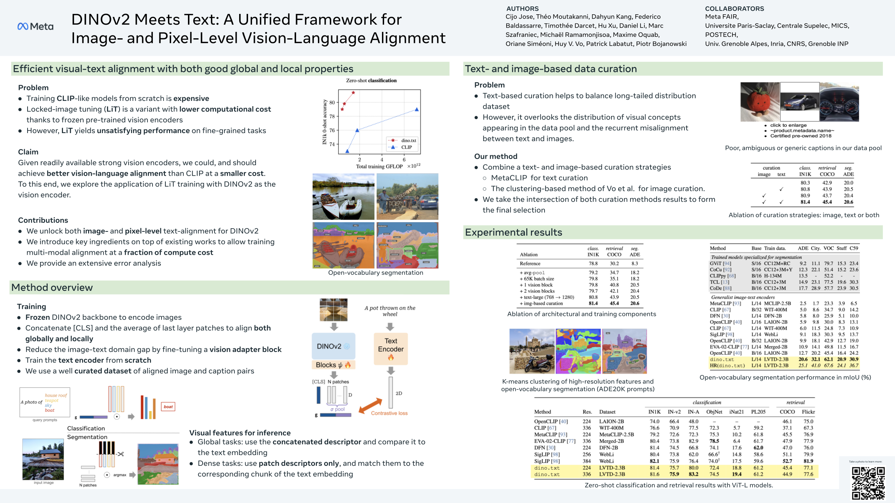 | [📄 Paper](https://openaccess.thecvf.com/content/CVPR2025/html/Jose_DINOv2_Meets_Text_A_Unified_Framework_for_Image-_and_Pixel-Level_CVPR_2025_paper.html)   [💻 Code](https://github.com/facebookresearch/dinov2)  [🎥 Video](https://youtu.be/qNsAgsvhbw4) | Enhancing dinov2 with text ability, surpasses CLIP for image-text association and representation learning  |

## Video Grounding / Search

| Paper Title | Poster | Resources | Description |
|-------------|--------|-----------|-------------|
| **VideoGEM: Training-free Action Grounding in Videos**  | 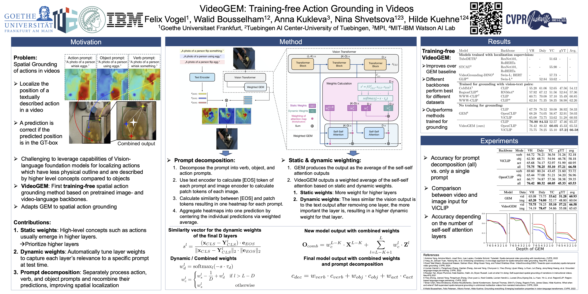 | [📄 Paper](https://openaccess.thecvf.com/content/CVPR2025/html/Vogel_VideoGEM_Training-free_Action_Grounding_in_Videos_CVPR_2025_paper.html)   [💻 Code]  [🎥 Video] | Perform prompt decomposition and use static and dynamic weighting GEM module to do action recognition |
| **Re-thinking Temporal Search for Long-Form Video Understanding**  | 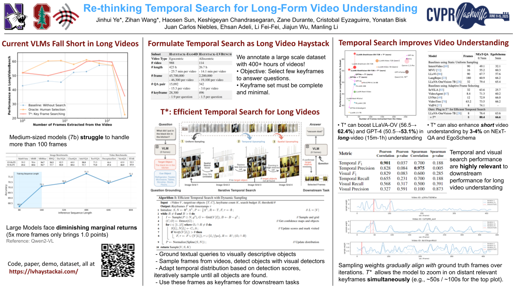 | [📄 Paper](https://openaccess.thecvf.com/content/CVPR2025/html/Ye_Re-thinking_Temporal_Search_for_Long-Form_Video_Understanding_CVPR_2025_paper.html)   [💻 Code](https://lvhaystackai.com/)  [🎥 Video] | Smart frame selector leveraging on cue and target object search using additional module for zero-shot detection and scoring to identify possible locality before zooming into segment for in depth analysis |
| **RELOCATE: A Simple Training-Free Baseline for Visual Query Localization Using Region-Based Representations**  | 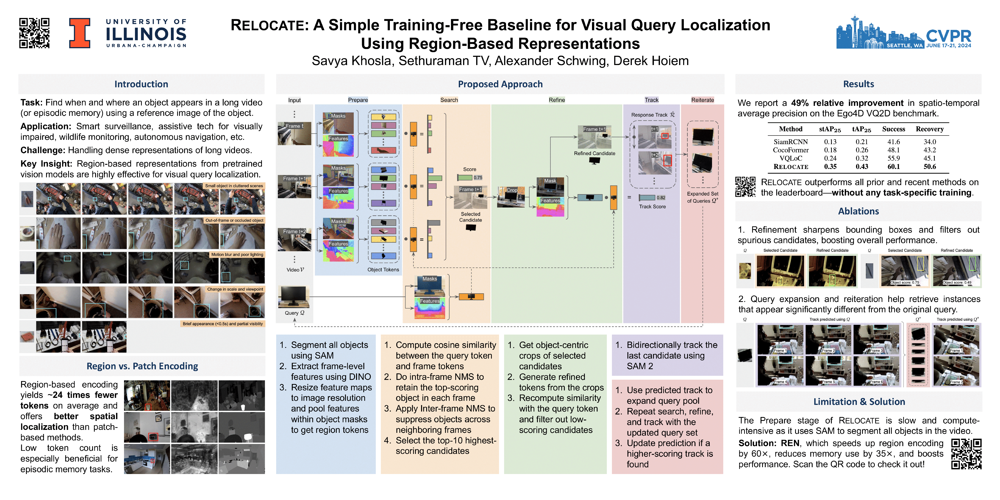 | [📄 Paper](https://openaccess.thecvf.com/content/CVPR2025/html/Khosla_RELOCATE_A_Simple_Training-Free_Baseline_for_Visual_Query_Localization_Using_CVPR_2025_paper.html)   [💻 Code]  [🎥 Video](https://youtu.be/OJ7TwQ4gzts) | Using SAM and DINO to perform image-based object query on videos |
| **BIMBA: Selective Scan Compression for Long Range Video QA**  |  | [📄 Paper](https://openaccess.thecvf.com/content/CVPR2025/html/Islam_BIMBA_Selective-Scan_Compression_for_Long-Range_Video_Question_Answering_CVPR_2025_paper.html)   [💻 Code]  [🎥 Video](https://youtu.be/YIU2XypsT-o) | Uses MAMBA for video search and scanning of spatial-temporal tokens. Said to be more efficient than transformer based architectures |
| **Number it: Temporal Grounding Videos like Flipping Manga**  |  | [📄 Paper](https://openaccess.thecvf.com/content/CVPR2025/html/Wu_Number_it_Temporal_Grounding_Videos_like_Flipping_Manga_CVPR_2025_paper.html)   [💻 Code]  [🎥 Video] | Simple idea of video search by appending a frame/page number to the top left of the image, allowing VLM to identify which frame contains the information of interest |
| **ReVisionLLM: Recursive Vision-Language Model for Temporal Grounding in Hour-Long Videos**  |  | [📄 Paper](https://arxiv.org/abs/2411.14901)   [💻 Code]  [🎥 Video] | Idea to train an encoder module to identify the rough location of the target video scene in 5min chunk, before zooming into frame-level for specific target segment|

## Temporal and Motion in VLM

| Paper Title | Poster | Resources | Description |
|-------------|--------|-----------|-------------|
| **Temporal Alignment-Free Video Matching for Few-shot Action Recognition**  | 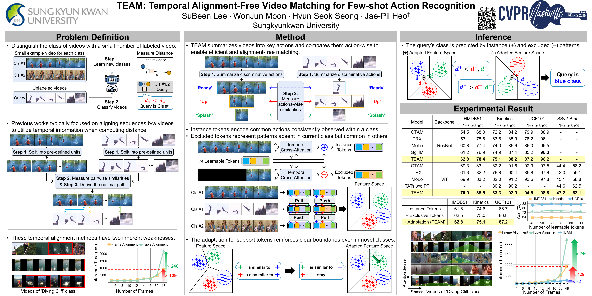 | [📄 Paper](https://openaccess.thecvf.com/content/CVPR2025/html/Lee_Temporal_Alignment-Free_Video_Matching_for_Few-shot_Action_Recognition_CVPR_2025_paper.html)   [💻 Code](https://github.com/leesb7426/TEAM)  [🎥 Video](https://youtu.be/Pk_JKFuNJj4) | Few shot action recognition for unseen or OOD actions via clustering |
| **MotionBench: Benchmarking and Improving Fine-grained Video Motion Understanding for Vision Language Models**  | 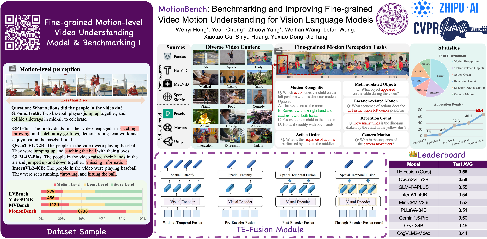 | [📄 Paper](https://openaccess.thecvf.com/content/CVPR2025/html/Hong_MotionBench_Benchmarking_and_Improving_Fine-grained_Video_Motion_Understanding_for_Vision_CVPR_2025_paper.html)   [💻 Code]  [🎥 Video] | A motion focused dataset and benchmark for VLM, including novel TE-Fusion module to enhance pre-trained VLM's with better finegrained motion understanding |
| **Context-Enhanced Memory-Refined Transformer for Online Action Detection**  | 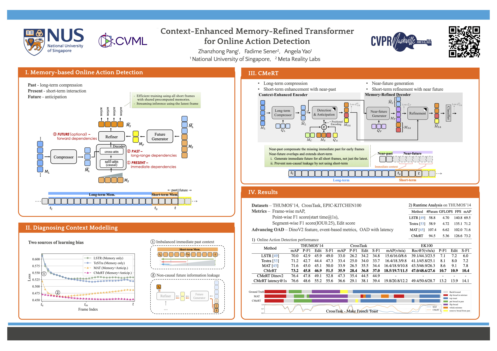 | [📄 Paper](https://openaccess.thecvf.com/content/CVPR2025/html/Pang_Context-Enhanced_Memory-Refined_Transformer_for_Online_Action_Detection_CVPR_2025_paper.html)   [💻 Code]  [🎥 Video](https://youtu.be/4Mck7RPxgHM) | Real Time Action detection |

## Pre-training, Finetuning and Visualization

| Paper Title | Poster | Resources | Description |
|-------------|--------|-----------|-------------|
| **Prompt-CAM: Making Vision Transformers Interpretable for Fine-Grained Analysis**  | 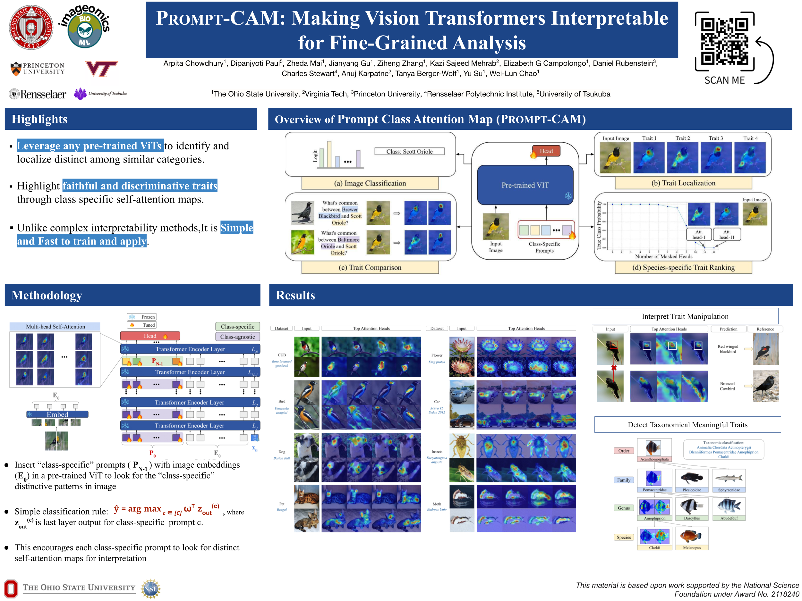 | [📄 Paper](https://openaccess.thecvf.com/content/CVPR2025/html/Chowdhury_Prompt-CAM_Making_Vision_Transformers_Interpretable_for_Fine-Grained_Analysis_CVPR_2025_paper.html)   [💻 Code]  [🎥 Video] | A simple finetune model to visualize a pre-trained model's attention behaviour |
| **Molmo and PixMo: Open Weights and Open Data for State-of-the-Art Vision-Language Models**  | 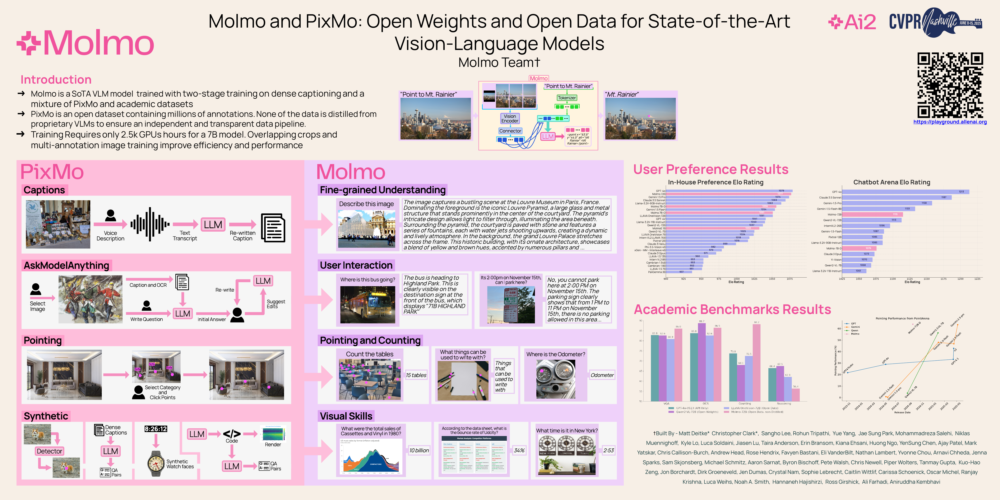 | [📄 Paper](https://arxiv.org/abs/2409.17146)   [💻 Code]  [🎥 Video](https://youtu.be/gkhG_XGzf4Y) | Presents state of the art VLM and dataset by Ai2 that excels in academia, image-based counting and pointing  |
| **Identifying and Mitigating Position Bias of Multi-image Vision-Language Models**  |  | [📄 Paper](https://arxiv.org/abs/2503.13792)   [💻 Code]  [🎥 Video](https://youtu.be/gHhO9PTXxYk) | An evaluation of multi-image VLM captioning and attention bias, and proposes a way to overcome it using  SOFt Attention (SOFA) |
| **Mitigating Hallucinations in Large Vision-Language Models via DPO: On-Policy Data Hold the Key**  |  | [📄 Paper](https://openaccess.thecvf.com/content/CVPR2025/html/Yang_Mitigating_Hallucinations_in_Large_Vision-Language_Models_via_DPO_On-Policy_Data_CVPR_2025_paper.html)(https://arxiv.org/abs/2501.09695)   [💻 Code](https://opa-dpo.github.io/)  [🎥 Video](https://youtu.be/X3vk9LziL6Q) | A novel DPO framework called On-Policy Alignment-DPO (OPA-DPO) to further reduce hallucination to overcome the KL divergence between updated policy and reference policy in standard DPO  |
| **Thinking in Space: How Multimodal Large Language Models See, Remember, and Recall Spaces**  | 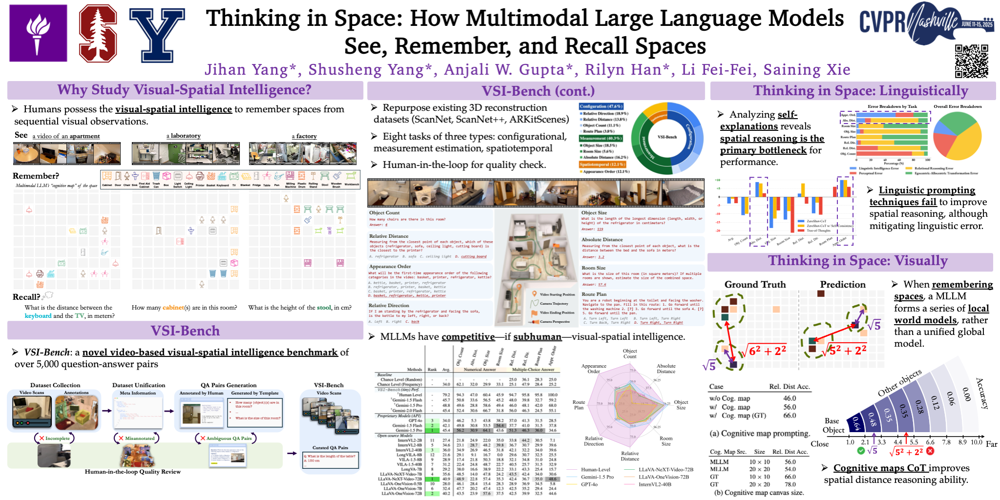 | [📄 Paper](https://arxiv.org/abs/2412.14171#:~:text=We%20probe%20models%20to%20express,do%20emerge%20within%20these%20models.)   [💻 Code]  [🎥 Video] | Identifies inherent limitation with VLMs in video-based spatial awareness extending to counting, distance and referencing objects. Paper proposes dataset repurposed from 3D dataset to alleviate some of these problems  |
| **Overcoming Shortcut Problem in VLM for Robust Out-of-Distribution Detection**🌟  |  | [📄 Paper](https://arxiv.org/abs/2503.13792)   [💻 Code](https://github.com/HAIV-Lab/OSPCoOp_Imagenet-bg)  [🎥 Video](https://youtu.be/8E0rqCAER8Y) | Identifies the issue of background interference in VLM's for OOD data, associating background of in-domain training for classification. Proposes finetuning dataset to overcome this problem |
| **LoRASculpt: Sculpting LoRA for Harmonizing General and Specialized Knowledge in Multimodal Large Language Models**  | 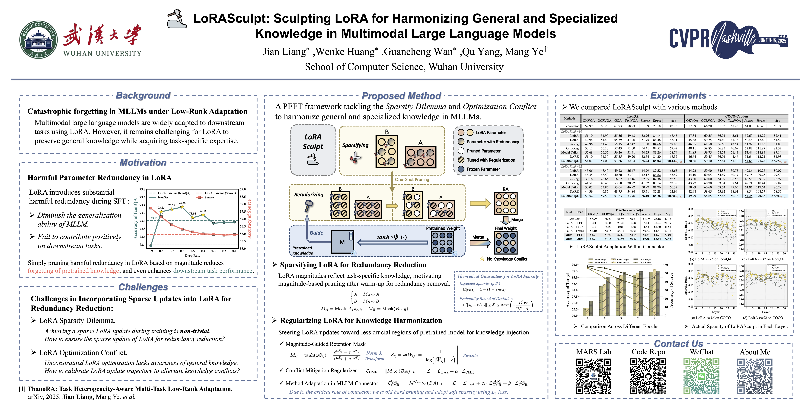 | [📄 Paper](https://arxiv.org/abs/2503.16843)   [💻 Code]  [🎥 Video] | Approach to overcome catastrophic forgetting issue from lora - via freezing connector. Surpass lora peft based approaches. |

## Segmentation

| Paper Title | Poster | Resources | Description |
|-------------|--------|-----------|-------------|
| **CALICO: Part-Focused Semantic Co-Segmentation with Large Vision-Language Models**  |  | [📄 Paper](https://openaccess.thecvf.com/content/CVPR2025/html/Nguyen_CALICO_Part-Focused_Semantic_Co-Segmentation_with_Large_Vision-Language_Models_CVPR_2025_paper.html)   [💻 Code](https://plan-lab.github.io/calico)  [🎥 Video](https://youtu.be/xr0XIrpXG68) | Part Segmentation Model for human/animal parts |
| **Describe Anything: Detailed Localized Image and Video Captioning**  |  | [📄 Paper]   [💻 Code]  [🎥 Video] |Efficient VLM to describe SAM segments in detail, could be used for detailed PAR/VAR |
| **Mamba as a Bridge: Where Vision Foundation Models Meet Vision Language Models for Domain-Generalized Semantic Segmentation**🌟  | 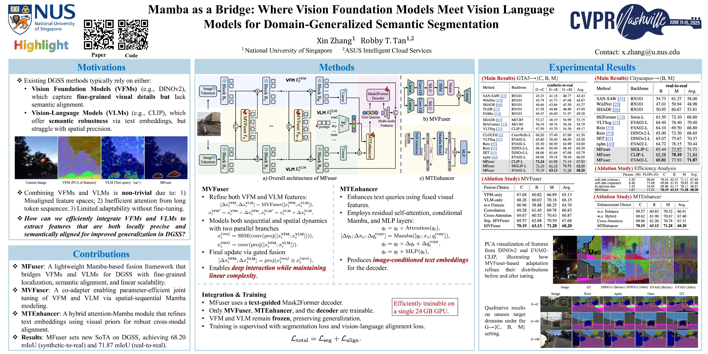 | [📄 Paper](https://arxiv.org/abs/2504.03193)   [💻 Code](https://devinxzhang.github.io/MFuser_ProjPage/)  [🎥 Video] | Using MAMBA to bridge the capabilites of CLIP in text-alignment and DINOv2 in capturing features to perform semantic segmentation |
| **Your ViT is Secretly an Image Segmentation Model** 🌟 | 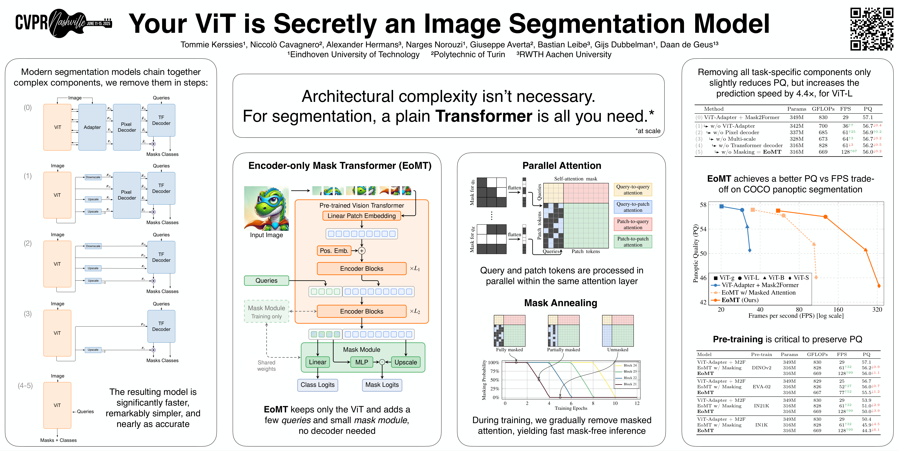 | [📄 Paper](https://arxiv.org/abs/2503.19108)   [💻 Code](https://www.tue-mps.org/eomt/)  [🎥 Video] | Low-param transformer only segmentation model, can explore for lightweight options |
| **Effective SAM Combination for Open-Vocabulary Semantic Segmentation**  | 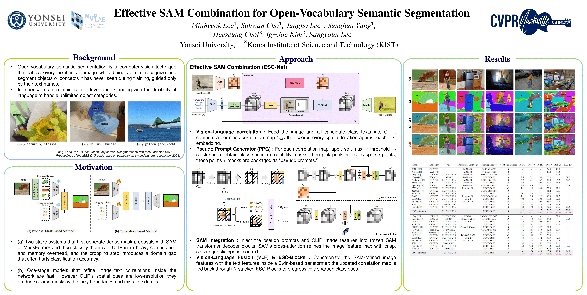 | [📄 Paper](https://arxiv.org/abs/2411.14723)   [💻 Code]  [🎥 Video] | Efficient open vocab segmentation for SAM using proposes ESC-Net pipeline |

## Video Anomaly Detection

| Paper Title | Poster | Resources | Description |
|-------------|--------|-----------|-------------|
| **Track Any Anomalous Object: A Granular Video Anomaly Detection Pipeline**  |  | [📄 Paper](https://openaccess.thecvf.com/content/CVPR2025/html/Huang_Track_Any_Anomalous_ObjectA_Granular_Video_Anomaly_Detection_Pipeline_CVPR_2025_paper.html)   [💻 Code]  [🎥 Video] | Pixel Level anomaly detection and tracking for more fine-grained anomaly detection compared to scene or object anomaly |
| **VERA: Explainable Video Anomaly Detection via Verbalized Learning of Vision-Language Models**  |  | [📄 Paper](https://openaccess.thecvf.com/content/CVPR2025/html/Ye_VERA_Explainable_Video_Anomaly_Detection_via_Verbalized_Learning_of_Vision-Language_CVPR_2025_paper.html)   [💻 Code](https://vera-framework.github.io/)   [🎥 Video](https://www.youtube.com/watch?v=wyWWpjt4aeE) | Verbalized Learning approach for VLM to detect anomaly using learnable guide prompts. The anomaly detection module is a small module based on the VLM to learn a set of guiding questions based on the input prompt to help the VLM verbalize and generalize better. |
| **Shopformer: Transformer-Based Framework for Detecting Shoplifting via Human Pose**  |  | [📄 Paper]   [💻 Code]  [🎥 Video] | Pose-based shoplifting detection based on US privacy laws |
| **AssistPDA: An Online Video Surveillance Assistant for Video Anomaly Prediction, Detection, and Analysis**  |  | [📄 Paper]   [💻 Code]  [🎥 Video] | Live VLM based anomaly and crime detection by NUS. No code yet. Not actually CVPR |

## Traffic Understanding

| Paper Title | Poster | Resources | Description |
|-------------|--------|-----------|-------------|
| **RoadSocial: A Diverse VideoQA Dataset and Benchmark for Road Event Understanding from Social Video Narratives**  | 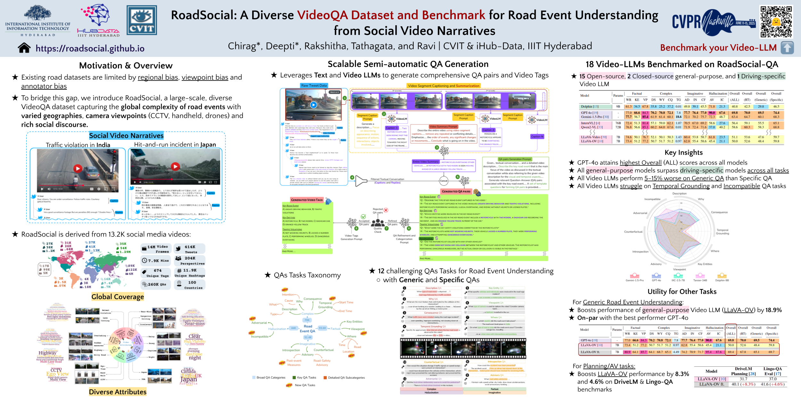 | [📄 Paper](https://openaccess.thecvf.com/content/CVPR2025/html/Parikh_RoadSocial_A_Diverse_VideoQA_Dataset_and_Benchmark_for_Road_Event_CVPR_2025_paper.html)   [💻 Code](https://roadsocial.github.io/)  [🎥 Video](https://www.youtube.com/watch?v=OZ6iLjoQ8SU) | A dataset collected from traffic videos all over the world, including violation videos for traffic event QA, captioning and violation detection etc. The team finetuned their own Llava OV model on the dataset which can be tested |
| **EchoTraffic: Enhancing Traffic Anomaly Understanding with Audio-Visual Insights**  |  | [📄 Paper](https://openaccess.thecvf.com//content/CVPR2025/papers/Xing_EchoTraffic_Enhancing_Traffic_Anomaly_Understanding_with_Audio-Visual_Insights_CVPR_2025_paper.pdf)   [💻 Code](https://github.com/HarryHsing/EchoTraffic)  [🎥 Video] | Audio-Visual-Text approach for traffic anomaly understanding using a fusion of audio spectro signal to identify possible emergency brakes, collisions and repeated horning. Proposes dataset and finetuned model |
| **Embodied Scene Understanding for Vision Language Models via MetaVQA**  |  | [📄 Paper](https://openaccess.thecvf.com/content/CVPR2025/html/Wang_Embodied_Scene_Understanding_for_Vision_Language_Models_via_MetaVQA_CVPR_2025_paper.html)   [💻 Code]  [🎥 Video] | Embodied traffic scene understanding for vla via MetaVQA, trained on real and ego-centric video. But do not have knowledge of violation due to vla focus. |

## Vision Language Action (VLA)

| Paper Title | Poster | Resources | Description |
|-------------|--------|-----------|-------------|
| **Magma: A Foundation Model for Multimodal AI Agentst**  |  | [📄 Paper](https://openaccess.thecvf.com/content/CVPR2025/html/Yang_Magma_A_Foundation_Model_for_Multimodal_AI_Agents_CVPR_2025_paper.html)   [💻 Code](https://microsoft.github.io/Magma/)  [🎥 Video] | All in one robot based VLM includng various VLA and agentic tasks. Still limited in terms of robot navigation, expected to have a updated version later in 2025 |
| **From Multimodal LLMs to Generalist Embodied Agents: Methods and Lessons**  |  | [📄 Paper](https://arxiv.org/html/2412.08442v1)   [💻 Code]  [🎥 Video] | Proposed method to train generalist embodied agents for VLA from MLLMs |
